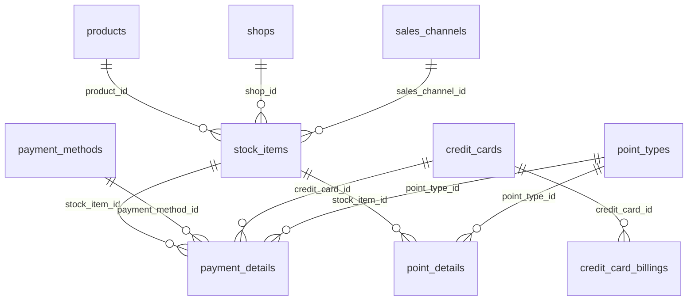

# DBテーブル定義書

- 作成日：2026年7月29日
- バージョン：1.0（第一フェーズ）
- 対象DB：PostgreSQL
- 対応する要件定義書：`docs/せどり管理アプリ_要件定義書.md`

---

## 0. 共通方針

### 0.1 全テーブル共通カラム（要件定義書 §2.1）

すべてのテーブルに以下を持たせる（以下の一覧では省略し、個別テーブル定義には記載しない）。

| カラム名 | 型 | 内容 |
|---|---|---|
| id | serial (PK) | 主キー |
| delete_flag | boolean, NOT NULL, default false | 論理削除フラグ（物理削除は行わない） |
| created_at | timestamp, NOT NULL, default now() | 作成日時 |
| updated_at | timestamp, NOT NULL, default now() | 更新日時 |

作成者／更新者カラムは第一フェーズでは持たない。

### 0.2 DBマスタ vs 設定ファイル

以下はDBテーブルではなく、アプリ設定ファイル（例: `config/accounts.ts`）でid→名称を管理し、アプリ側で解決する（DB外部キーではない）。項目数が少なく将来的にも増減が稀なもの。

| 設定ファイル（例） | 内容 |
|---|---|
| `config/accounts.ts` | アカウント（仕入に使った自分たちの口座。本垢／嫁垢等） |
| `config/credit_card_brands.ts` | クレジットカードブランド（Visa／Amex／JCB 等） |
| `config/purchase_types.ts` | 仕入れ区分（EC／店舗） |
| `config/purchase_sites.ts` | ①モール/カテゴリ（ヤフーショッピング／楽天市場／Amazon／公式オンラインショップ 等。ECの場合のみ使用） |

これらは `stock_items` 等から `_key`（文字列キー）として参照する想定。

### 0.3 テーブル一覧

| テーブル名 | 概要 |
|---|---|
| products | 商品マスタ |
| shops | 仕入れ先マスタ（②具体的な仕入れ先名） |
| sales_channels | 販売先マスタ |
| payment_methods | 支払い方法マスタ |
| point_types | ポイント種別マスタ |
| credit_cards | クレジットカードマスタ |
| credit_card_billings | クレジットカード請求額（3.3.3） |
| stock_items | 購入商品登録（メインテーブル） |
| payment_details | 支払い内訳（stock_itemsに対して1対多） |
| point_details | ポイント内訳（stock_itemsに対して1対多） |

---

## 1. products（商品マスタ）

要件定義書 §3.2 に対応。

| カラム名 | 型 | NOT NULL | 説明 |
|---|---|---|---|
| name | varchar | ○ | 正式商品名 |
| short_name | varchar | - | 省略表示名 |
| jan_code | varchar | - | JANコード。ギフトカード等は空欄可。**UNIQUE制約あり（delete_flag=falseの範囲で）** |
| category | varchar | - | 商品カテゴリ |

**備考**
- JANコードが入力された場合、登録時に重複チェックを行い、同一JANの既存商品があればそれに紐付ける（新規作成しない）。

---

## 2. shops（仕入れ先マスタ）

要件定義書 §3.5 に対応。仕入れ区分（EC/店舗）・①モール/カテゴリは設定ファイル管理のため、このテーブルには②仕入れ先名のみを持つ。

| カラム名 | 型 | NOT NULL | 説明 |
|---|---|---|---|
| name | varchar | ○ | 仕入れ先名（ヤマダデンキ、エディオン、カメラのキタムラ 等） |

---

## 3. sales_channels（販売先マスタ）

要件定義書 §3.4 に対応。

| カラム名 | 型 | NOT NULL | 説明 |
|---|---|---|---|
| corporate_number | varchar | - | 法人番号（確定申告での利用を想定）。取得できない販売先もあるため任意 |
| company_name | varchar | ○ | 正式企業名 |
| shop_name | varchar | ○ | 店舗/ショップの表示名（モール出店名、Yフリマ等） |

**備考**
- 1レコード＝1店舗。同一法人が複数店舗を持つ場合、corporate_number・company_nameは行ごとに重複させてよい（正規化しない）。

---

## 4. payment_methods（支払い方法マスタ）

要件定義書 §3.3 に対応。固定に近いリストだが、payment_detailsからFK参照するためDBマスタとして持つ。

| カラム名 | 型 | NOT NULL | 説明 |
|---|---|---|---|
| name | varchar | ○ | 支払い方法名（クレジットカード／ギフトカード／現金／振込／ポイント） |

---

## 5. point_types（ポイント種別マスタ）

要件定義書 §3.6 に対応。

| カラム名 | 型 | NOT NULL | 説明 |
|---|---|---|---|
| name | varchar | ○ | ポイント種別名（PayPay／楽天ポイント／WAON 等）。予測変換＋新規追加ボタンで登録 |

---

## 6. credit_cards（クレジットカードマスタ）

要件定義書 §3.3.1 に対応。

| カラム名 | 型 | NOT NULL | 説明 |
|---|---|---|---|
| account_key | varchar | ○ | カードの持ち主。`config/accounts.ts` のキー（DB外部キーではない） |
| brand_key | varchar | ○ | ブランド。`config/credit_card_brands.ts` のキー |
| card_name | varchar | ○ | 楽天ゴールドカード、ヒルトンカード等の正式名称 |
| card_last4 | varchar(4) | - | カード番号下4桁のみ（完全な番号は保持しない） |
| display_name | varchar | ○ | 一覧表示用の短縮名（例：楽天ゴールド(h)） |
| holder_name | varchar | ○ | カード名義人 |
| status | varchar | ○ | 契約中／解約済 |
| joined_date | date | ○ | 入会日 |
| canceled_date | date | - | 解約日（未解約なら空欄） |
| annual_fee_flag | boolean | ○ | 年会費有無 |
| annual_fee_amount | integer | - | 年会費有無が「有」の場合の金額 |
| annual_fee_payment_day | integer | - | 年会費の引き落とし日（1〜31） |
| memo | text | - | 自由記述 |

---

## 7. credit_card_billings（クレジットカード請求額）

要件定義書 §3.3.3 に対応。カード明細を見ながら手動で入力する台帳。カード×請求年月のマトリクス表示に使う。

| カラム名 | 型 | NOT NULL | 説明 |
|---|---|---|---|
| credit_card_id | integer (FK → credit_cards.id) | ○ | 対象クレジットカード |
| billing_year_month | date（日は1固定 等） | ○ | 請求対象年月 |
| billed_amount | integer | ○ | 請求予定額（手動入力） |

**備考**
- 支払済みフラグは持たない。
- `(credit_card_id, billing_year_month, delete_flag)` で実質ユニーク（同一カード・同一年月は1行）。
- 画面表示時はcredit_cardsのaccount_key・annual_fee_payment_day等を引き継いでアカウント単位グルーピング・月次小計を行う。

---

## 8. stock_items（購入商品登録・メインテーブル）

要件定義書 §3.7・§3.8 に対応。仕入れ〜販売の1取引＝1行。

| カラム名 | 型 | NOT NULL | 説明 |
|---|---|---|---|
| product_id | integer (FK → products.id) | ○ | 対象商品 |
| group_id | uuid または varchar | - | 複数商品をまとめて1回で売却した場合に同じ値を持たせる。単独売却時はNULL |
| account_key | varchar | ○ | 仕入れに使った自分たちの口座。`config/accounts.ts` のキー |
| purchase_type_key | varchar | ○ | 仕入れ区分（EC／店舗）。`config/purchase_types.ts` のキー |
| purchase_site_key | varchar | - | ①モール/カテゴリ。`config/purchase_sites.ts` のキー。仕入れ区分がECの場合のみ使用 |
| shop_id | integer (FK → shops.id) | ○ | ②仕入れ先（shopsマスタ参照） |
| purchase_price | integer | ○ | 仕入れ価格 |
| purchase_date | date | ○ | 仕入れ日 |
| point_reward_total | integer | ○（自動計算, default 0） | ポイント還元合計。`Σ point_details.amount` |
| net_purchase_price | integer | ○（自動計算） | 実質価格。`purchase_price - point_reward_total` |
| sales_channel_id | integer (FK → sales_channels.id) | - | 販売先。未販売の場合はNULL |
| sales_price | integer | - | 売上価格。未販売の場合はNULL |
| sales_date | date | - | 販売日。未販売の場合はNULL |
| profit | integer | - （自動計算） | 利益。`sales_price - net_purchase_price`（未販売時はNULL） |
| profit_rate | numeric(6,2) | - （自動計算） | 利益率(%)。`profit / sales_price * 100`（未販売時はNULL） |
| arrived_flag | boolean | ○ (default false) | 到着済みチェック |
| sold_flag | boolean | ○ (default false) | 売却チェック |
| memo | text | - | 備考 |

**ステータスについて**
- ステータス（到着待ち／保有中／売却済み）はDBカラムとしては持たず、`arrived_flag` / `sold_flag` からアプリ側（クエリ or 表示層）で導出する派生値とする。
  - `arrived_flag = false` → 到着待ち
  - `arrived_flag = true` かつ `sold_flag = false` → 保有中
  - `sold_flag = true` → 売却済み

**自動計算カラムについて**
- `point_reward_total` / `net_purchase_price` / `profit` / `profit_rate` は生成カラム（GENERATED ALWAYS AS）ではなく通常カラムとし、stock_items・point_details保存時にアプリ側で再計算して書き戻す（point_details保存時に親のstock_itemsも再計算するため）。

**備考**
- 手数料（販売手数料・送料等）はカラムとして持たない。

---

## 9. payment_details（支払い内訳）

要件定義書 §3.3.2 に対応。stock_itemsに対して1対多。

| カラム名 | 型 | NOT NULL | 説明 |
|---|---|---|---|
| stock_item_id | integer (FK → stock_items.id) | ○ | 親の購入商品登録 |
| payment_method_id | integer (FK → payment_methods.id) | ○ | 支払い方法 |
| amount | integer | ○ | この支払い方法で払った金額 |
| credit_card_id | integer (FK → credit_cards.id) | - | payment_methodが「クレジットカード」の場合のみ使用 |
| point_type_id | integer (FK → point_types.id) | - | payment_methodが「ポイント」の場合のみ使用（何のポイントで支払ったか） |
| memo | text | - | 自由記述 |

---

## 10. point_details（ポイント内訳）

要件定義書 §3.7 に対応。stock_itemsに対して1対多（仕入れ時に獲得したポイント）。CSVでは3枠固定だったが、DBでは件数無制限。

| カラム名 | 型 | NOT NULL | 説明 |
|---|---|---|---|
| stock_item_id | integer (FK → stock_items.id) | ○ | 親の購入商品登録 |
| point_type_id | integer (FK → point_types.id) | ○ | ポイント種別 |
| amount | integer | ○ | 獲得ポイント金額 |

---

## 11. ER図（概念）

（アカウント／ブランド／仕入れ区分／モール・カテゴリは設定ファイル管理のためER図には含めない）

---

## 12. 今後の検討事項

- データのバックアップ／エクスポート機能（CSV出力等）：物理設計（pg_dump運用、エクスポートAPIの要否）は先送り。
- group_idの型（uuid vs varchar連番）は実装時に決定。
