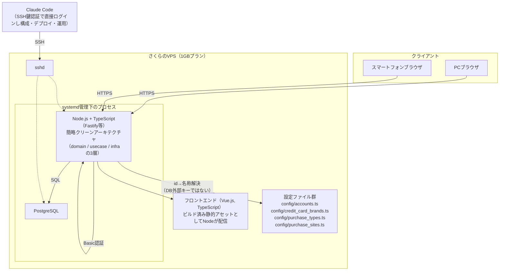
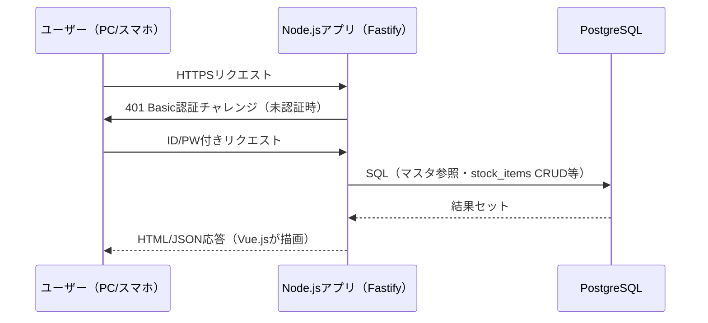

# システム構成図

- 作成日：2026年7月29日（2026年7月30日 技術構成変更に伴い改訂）
- バージョン：1.1（第一フェーズ）
- 対応する要件定義書：`docs/せどり管理アプリ_要件定義書.md` §1・§2

---

## 1. 全体構成

さくらのVPS（1GBプラン）1台に、Node.jsアプリ・PostgreSQLともにDockerを使わず直接インストールし、systemdでプロセス管理する構成。メモリが限られたVPSでの消費を抑えることを優先し、コンテナ化は行わない。開発・本番の分離は第一フェーズでは考慮しない。

---

## 2. コンポーネント説明

| コンポーネント | 役割 |
|---|---|
| クライアント（PC/スマホブラウザ） | レスポンシブ対応のVue.js画面を表示。PC・スマートフォン両対応必須。VPNは使わず、VPSの公開URLへHTTPS/Basic認証で直接アクセス |
| Node.jsアプリ | フロント配信・API・ドメインロジック（マスタCRUD・購入商品登録・利益計算・月次集計）を担う。Fastify等の軽量フレームワーク上に、domain（商品/在庫/利益計算等のロジック）／usecase（ユースケース）／infra（DBアクセス・HTTPルーティング）の3層で構成する簡略クリーンアーキテクチャ |
| Basic認証 | アプリ全体へのアクセス制御。単一/少数の固定アカウント運用、権限分離なし。Node.jsアプリ側のミドルウェアで実装 |
| フロントエンド（Vue.js） | TypeScriptで構築。ビルド済み静的アセットをNode.jsアプリが配信 |
| PostgreSQL | マスタ・取引データの永続化（`docs/DBテーブル定義書.md`参照）。VPSに直接インストールし、Node.jsアプリと同一VPS上でsystemd管理 |
| 設定ファイル群（`config/*.ts`） | アカウント・クレジットカードブランド・仕入れ区分（EC/店舗）・①モール/カテゴリ等、頻度高く増減しないマスタ的データをid→名称でハードコード管理。DBの外部キーにはせず、アプリ側で解決する |
| systemd | Node.jsアプリ・PostgreSQLのプロセス管理（自動起動・再起動）。Dockerは使用しない（1GB VPSでのメモリオーバーヘッドを避けるため） |
| SSH（鍵認証） | Claude Codeを含む開発者が直接VPSへログインし、構成変更・デプロイ・トラブル対応を行う経路。パスワード認証は無効化し鍵認証のみとする |

---

## 3. 認証・アクセス制御フロー

---

## 4. 運用・セキュリティ方針（VPS）

- パスワード認証は無効化し、SSHは鍵認証のみとする。
- ファイアウォール（ufw等）で開放ポートを最小化（HTTPS・SSHのみ）。
- fail2ban等でSSH総当たり対策を行う。
- バックアップ（DBダンプ等）の詳細は要件定義書§6のとおり設計時以降に先送り。
